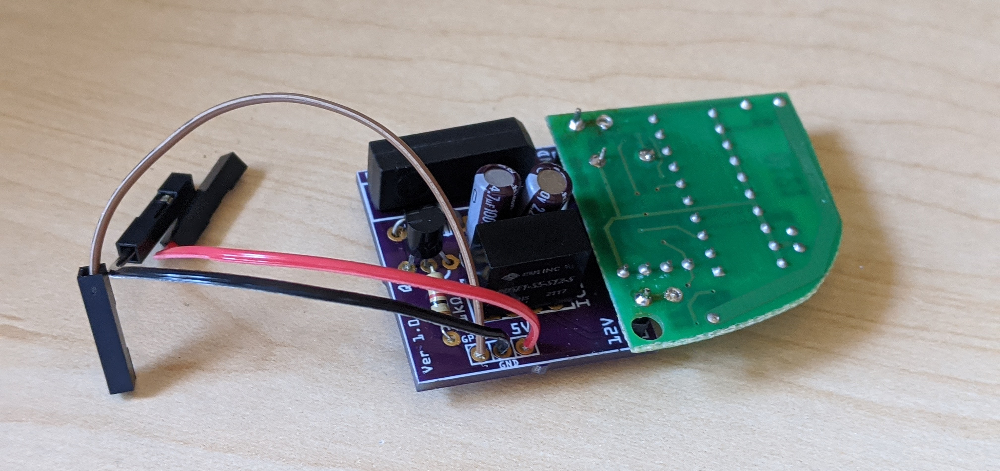

# rpi-gate-opener

## Open Your Gate From Anywhere!


This little gadget allows you to connect a [300 MHz, 10 dip-switch remote gate opener](https://www.amazon.com/gp/product/B0015GDW3U/) to a Raspberry Pi so that you can open a gate with just a few lines of code.

It connects directly to an off-the-shelf gate opener remote (sold separately) and uses a 5V relay for triggering the gate opener and a voltage conversion circuit for powering the gate opener (replacing the gate opener's battery). It requires only 5V power, ground, and a single GPIO pin from your Raspberry Pi.

## Can I just buy one from you?
Yes! You can [buy this kit at different levels of assembly from me on Tindie](https://www.tindie.com/products/flyingsaucrdude/raspberry-pi-gate-opener-adapter/).

## I'd rather build one myself!
Great! Just follow [the instructions in my tutorial](https://www.hackster.io/jeremy-gillula/raspberry-pi-wireless-gate-opener-734460) to finish assembly of your controller circuit.

## What's in the repo?

- **[build](build)** — Scripts and files for generating the ```[configure](configure)``` script. End users shouldn't need to worry about this.
- **[images](images)** — Pictures of the finished product
- **[pcb](pcb)** — Extended Gerber (RS-274X) files for PCB fabrication (at, e.g., [OSH Park](https://oshpark.com/))
- **[src](src)** — Source code for controlling the gate opener over MQTT (and Home Assistant). For more information, see [the instructions on hackster.io](https://www.hackster.io/jeremy-gillula/connecting-a-remote-gate-opener-to-a-raspberry-pi-734460#toc-7--bonus--controlling-the-gate-via-mqtt-and-home-assistant-8).
- **[Gate_Opener_Controller_Circuit.fzz](Gate_Opener_Controller_Circuit.fzz)** — Fritzing file containing schematic and PCB layout
- **[configure](configure)** — Run this script to generate the ```Makefile``` to install the code.
